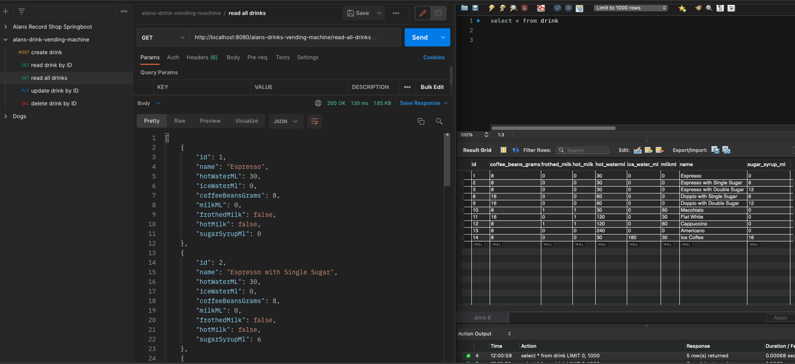

# Alan’s Drinks Vending Machine Project

### What is the project?
The aim of the project is to demonstrate my ability to develop an API with CRUD functionality for the final assessment (SFIA level 2/aligned with Apprenticeship level 4) of the QA software development bootcamp undertaken in January 2022. I decided to create a drinks vending machine which can make many types of coffee by mixing the ingredients in different proportions. The owner of the vending machine will be able to create/read/update/delete coffee recipes. The project will be built using Spring Boot with a MySQL database, and the owner will be able to make CRUD requests from Postman. Functionality of the API must have coverage with unit and integration testing.

### How did I expect the challenge to go?
I had undertaken several months of Java learning before starting the bootcamp, so I was already comfortable with most of the POJO Java. The tutors on the bootcamp helped me solidify some of the more challenging concepts. However, Spring Boot was completely new to me, I found it quite different from the Java I already knew, and we only had a short time to learn it. Consequently, I expected the project to be a challenge, particularly developing all the testing.

### What went well? /What didn’t go as planned?
The testing was the most challenging, and the most rewarding part of the project as it helped me to solidify my understanding of Mockito, unit testing and integration testing. I didn’t get the github branch structure correct at first, so that needed to be addressed.

### Improvements for future revisions of the project
Testing for read by name functionality and the custom exception should be completed. I would like to develop a front-end using HTML/CSS/JS. I would also like to create a customer interface to buy coffee from the vending machine. This would require an ingredients stock database which can be filled by the owner and from which stock is depleted when a customer buys a coffee.

## Authors and Acknowledgment
Developed by Alan Kerby with guidance from  Jordan Benbelaid.

## Contributing
Pull requests are welcome. For major changes, please open an issue first to discuss what you would like to change.
Please make sure to update tests as appropriate.

## License
[MIT](https://choosealicense.com/licenses/mit/)

## Usage

Below are screenshots of Postman and MySQL to demonstrate CRUD functionality.

### create-drink

### read-drink-by-id

### read-drink-by-name

### read-all-drinks

### update-drink-by-id

### delete-drink-by-id

## ERD

## Github
The Github project can be found here:
https://github.com/alanKerby/alans-drinks-vending-machine

## Jira
The Jira project can be found here:
https://alankerby.atlassian.net/jira/software/projects/ADVM/boards/3/roadmap
Contact alankerby@gmail.com to request access.
Please note the sprints do not appear on the board as they have been completed. See the “Roadmap” page to view epic/feature issues/user stories.

## Testing Coverage Report
Please note testing for read by name and the custom exception for delete by ID are not included in the report

### Main

### Domain

### Service

### Controller
